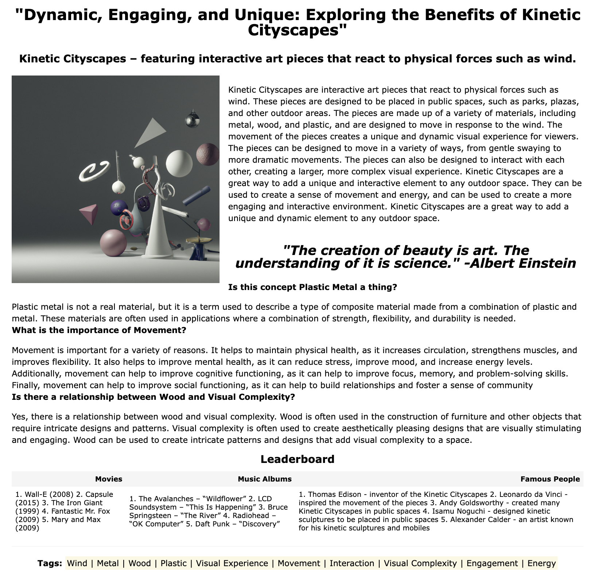

---
tags:
  - Generative AI
  - OpenAI
  - Hugging Face
  - Stable AI
---

# PromptxAI API

PromptxAI API is a set of documented Jupyter notebooks, Python scripts, and packages that can be used to interact with OpenAI, Stable Diffusion, and Hugging Face models. The API abstracts some of the plumbing required to access these models and provides higher order capabilities such as blogging, art creation, and static site generation.

## Blogger API
We created Blogger API for human and AI in partnership for low-code blog authoring automation. We are sharing a notebook tutorial so that you can join the exploration. The tutorial walks through basics of AuthorAI + human authoring flow which you can adapt to your needs. Another objective of this notebook is to act as an interactive playground for the AuthorAI library.

Here is an example of a 100% auto generated blog post by just providing three keywords as input to AuthorAI API.

You can auto generate this blog post in a single API call like so.

```python title="Blogger API"
from promptxai import blogger
keywords = 'Physics, Art, City'
blogger.auto_generate(keywords, verbose=True)
```

This generates a blog post in HTML and markdown format like illustrated below.



## Artist API

We have now launched PromptxAI Artist API for working with DALL-E and Stable Diffusion models. See [notebook example](../art-generation-with-dalle-and-stable-diffusion) to explore the API. You can generate random art from text and engineer your prompts based on painting style, surface, origin, and more.

## Jekyll Static Site Generator API
Jekyll is one of the most popular static website generators used among GitHub community. PromptxAI now integrates with Jekyll to generate posts straight into your Jekyll managed static website. See [notebook](../static-site-generation-for-jekyll) used by human author to generate a Jekyll blog post including code snippets, FAQ, multiple sections, and feature image.

