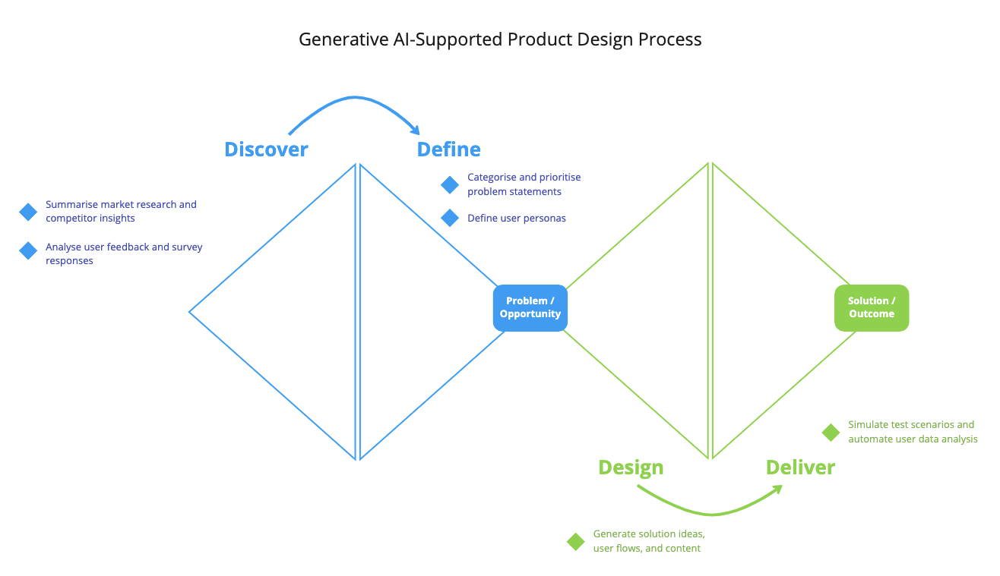

# Intersection of Generative AI and Product Design

Question: How might we help Product Designer adopt Generative AI to benefit their learning and get more efficient at their work?

Product Designer plays an important role in making a user fall in love with a product that they use. A designer’s day-to-day work involves applying their specialised knowledge and skills in user experience design to create products and services that meet the needs of users. They  spend their time researching, designing, prototyping, and testing products to ensure that they are user-friendly, accessible, and effective. 

Some scenarios of AI-supported tasks to improve Designer efficiency

Let’s take Sarah (28), a Product Designer as an example. Sarah has a degree in design and has worked as a UX designer for over 5 years. She has experience working on a range of products, from mobile apps to enterprise software. Sarah is passionate about designing products that are intuitive, easy to use, and solve real-world problems. By understanding Sarah’s life as a Product Designer, her day to day goals, challenges, and personality, we can identify some ways how she can adopt AI to improve her work efficiency and learning.

Sarah’s Goals and Motivations: 

- To design products that meet the needs of users and solve real-world problems
- To collaborate with cross-functional teams to create great products
- To create products that are beautiful, functional, and viable
- To stay up-to-date with the latest design trends and best practices
- To continuously improve her design skills and knowledge

Pain Points and Challenges:

- Balancing the needs of users with the business goals of the product
- Managing stakeholder feedback and ensuring that it aligns with the overall product vision
- Ensuring that accessibility and inclusivity are considered in the design process
- Managing time effectively to meet product timelines while delivering high-quality work

Values and Personality Traits:

- Creativity and innovation
- Empathy and user-centred design
- Collaboration and teamwork
- Attention to detail and focus on quality
- Continuous learning and improvement

As a knowledge worker, Sarah's success in her role depends on her ability to continually learn, stay up-to-date with the latest trends and best practices in UX design, and improve her efficiency. This is where AI can play a valuable role, by providing tools and techniques that can help her work more efficiently, solve problems more effectively, and create better products for users. 

In this Design Playbook series, we will explore the power of Generative AI to fuel the product innovation and Design Thinking process to help designers get more efficient in crafting delightful experiences for their users.
